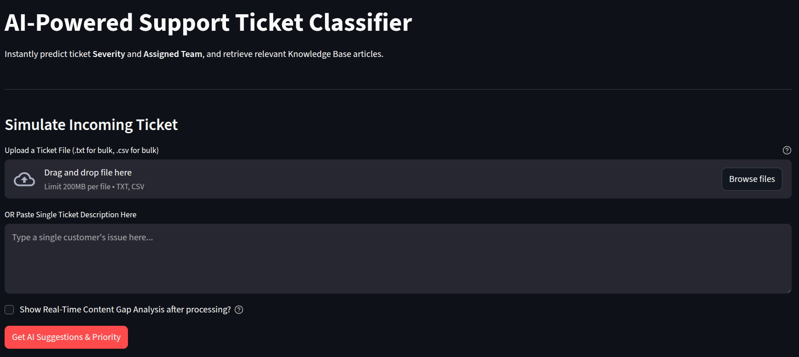

# Smart-Ticket-Classifier  

---

## Overview  
**Smart-Ticket-Classifier** is an AI-powered system that automatically categorises customer support tickets using Natural Language Processing (NLP) and Transformer models.  
It helps support teams reduce manual triage, improve response times, and optimize workflows through intelligent automation.  

###  Key Features  
- Automated classification of support tickets  
- Transformer-based NLP model for high accuracy  
- Real-time or batch prediction support  
- Interactive GUI dashboard  
- Knowledge-base embeddings and analytics  
- Content gap detection and performance reports  

---

## ⚙️ Installation  

1. **Clone the Repository**

       git clone https://github.com/s4sahiko/Smart-Ticket-Classifier.git
       cd Smart-Ticket-Classifier
   
2. **Create and Activate a Virtual Environment**

       python3 -m venv venv
       source venv/bin/activate     # For Linux/Mac
       venv\Scripts\activate        # For Windows

3. **Install Dependencies**
    
       pip install -r requirements.txt
    
4. **Prepare Dataset**
Use the provided **cleaned_ticket_data.csv**,
Or replace it with your own dataset and update file paths in the scripts.

5. **(Optional) Train the Model**

       python trainer.py

7. **Run the Application By running**

       python app.py

9. **Open the other terminal and Run to open the GUI Dashboard**

       python gui_dashboard.py

**Uplaod the ticket and Enjoy the saved time!**

---
Training
---

**Fine-tune the Transformer model using**
    
    python trainer.py

You can customize hyperparameters (learning rate, epochs, etc.) inside the script.

---
Classification
---

**After training, classify tickets in real time**
    
    python app.py

It reads ticket text and outputs predicted categories.

---
Dashboard & Reporting
---

**Generate performance reports and content gap analysis**
    
    python reporting_dashboard.py
    
Optionally, use the **knowledge_base_with_embeddings.csv** file to enhance classification accuracy.

---
Example Workflow
---

1. A new support ticket is received.

2. data_connector.py processes and cleans it.

3. categorizer.py uses the trained model to predict the category.

4. The result appears in the GUI or CLI (app.py or gui_dashboard.py).

5. Analytics and reports are generated automatically.

---
Tech Stack
---

**Language**: Python

**Libraries**: Transformers, Pandas, NumPy, Matplotlib etc.

**Frameworks**: PyTorch

**Visualization**: Streamlit

**Data**: CSV-based datasets and embeddings

---
Why Use This Project
---

**Efficiency** — Automates ticket routing

**Scalability** — Handles large datasets easily

**Accuracy** — Uses Transformer-based contextual understanding

**Insights** — Detects knowledge gaps and tracks model performance

---
Contact & Support
---

For questions, bug reports, or suggestions — open an issue on the GitHub repository.

👤 Author: **s4sahiko**

    
